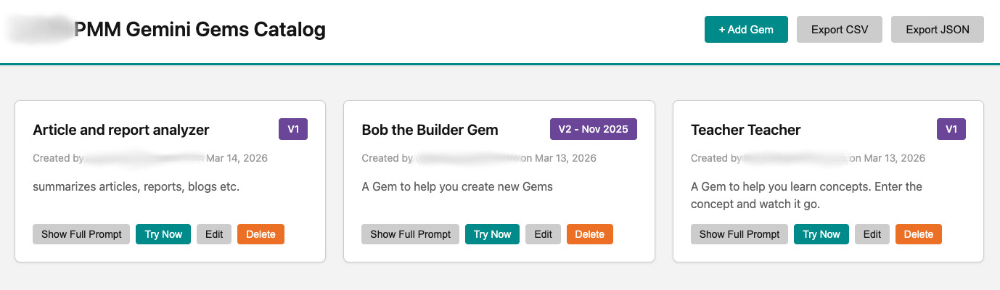

# Gemini Gems Catalog

A web-based catalog application for managing and sharing Google Gemini custom gems (system prompts) within your team. Built as a Google Apps Script web app with Google Sheets as the data backend.



## Features

- **Gem Management**: Create, read, update, and delete Gemini gems
- **File Tracking**: Associate up to 10 files (with URLs) per gem
- **Version Control**: Track gem versions and edit history
- **Audit Trail**: Automatic tracking of who created/edited gems and when
- **Export**: Download your gem catalog as CSV or JSON
- **Clean UI**: Red Hat-inspired design with expandable prompt views
- **Unsaved Changes Protection**: Warns before closing forms with unsaved data
- **URL Validation**: Validates file URLs before saving

## Prerequisites

- Google Account
- Access to Google Sheets
- Access to Google Apps Script

## Installation

### 1. Create a Google Sheet

1. Go to [Google Sheets](https://sheets.google.com)
2. Create a new spreadsheet
3. Add the following column headers in row 1:
   - A: `Title`
   - B: `Short Description`
   - C: `Version`
   - D: `Full Prompt`
   - E: `Shared URL`
   - F: `Created By`
   - G: `Created Date`
   - H: `Last Edited By`
   - I: `Last Edited Date`
   - J: `Files`
4. Note the Sheet ID from the URL (the long string between `/d/` and `/edit`)
   - Example: `https://docs.google.com/spreadsheets/d/SHEET_ID_HERE/edit`

### 2. Create Google Apps Script Project

1. Go to [Google Apps Script](https://script.google.com)
2. Click **New Project**
3. Delete the default `Code.gs` content

### 3. Add Project Files

Create the following files in your Apps Script project (click the + next to Files):

#### Server-Side Files (.gs)

1. **Code.gs** - Copy content from `Code.gs`
2. **AuthService.gs** - Copy content from `AuthService.gs`
3. **SheetService.gs** - Copy content from `SheetService.gs`
4. **config.gs** - Copy `config.example.gs`, rename to `config.gs`, and add your Sheet ID

#### Client-Side Files (.html)

1. **Index.html** - Copy content from `Index.html`
2. **Styles.html** - Copy content from `Styles.html`
3. **Script.html** - Copy content from `Script.html`

### 4. Configure Your Sheet ID

1. Copy `config.example.gs` to a new file named `config.gs`
2. Replace `YOUR_GOOGLE_SHEET_ID_HERE` with your actual Sheet ID from step 1
3. Save the file

### 5. Deploy as Web App

1. Click **Deploy** → **New deployment**
2. Click the gear icon → Select **Web app**
3. Configure:
   - **Description**: "Gemini Gems Catalog v1.0"
   - **Execute as**: Me
   - **Who has access**: Anyone with Google account (or your preferred setting)
4. Click **Deploy**
5. Authorize the app when prompted
6. Copy the web app URL

### 6. Customize (Optional)

In `Index.html`, replace `YOUR_TEAM_NAME` with your actual team name:
```html
<h1>YOUR_TEAM_NAME Gemini Gems Catalog</h1>
```

## Usage

### Adding a Gem

1. Click **+ Add Gem**
2. Fill in:
   - **Title**: Name of your gem
   - **Short Description**: Brief summary (max 200 chars)
   - **Version**: Version number (e.g., 1.0, v2.1)
   - **Full Prompt**: Complete system instructions
   - **Shared Gem URL**: Link to your shared Gemini gem
   - **Files** (optional): Add up to 10 files with names and URLs
3. Click **Save Gem**

### Viewing Gems

- Cards display title, version, description, and metadata
- Click **Show Full Prompt** to expand and view the complete prompt and associated files
- Click **Try Now** to open the gem in Gemini

### Editing & Deleting

- Click **Edit** to modify a gem
- Click **Delete** to remove a gem (requires confirmation)

### Exporting

- Click **Export CSV** to download all gems as a CSV file
- Click **Export JSON** to download all gems as JSON

## Technical Architecture

- **Backend**: Google Apps Script (server-side JavaScript)
- **Database**: Google Sheets (structured data storage)
- **Frontend**: HTML/CSS/JavaScript (client-side)
- **Authentication**: Google OAuth (automatic via Apps Script)
- **Hosting**: Google Apps Script Web App

## File Structure

```
├── Code.gs               # Main entry point and template rendering
├── AuthService.gs        # User authentication and email capture
├── SheetService.gs       # Database operations (CRUD)
├── config.example.gs     # Configuration template
├── Index.html            # HTML structure and layout
├── Styles.html           # CSS styling (Red Hat design system)
├── Script.html           # Client-side JavaScript logic
└── README.md             # This file
```

## Data Model

Each gem is stored as a row in Google Sheets with the following columns:

| Column | Type | Description |
|--------|------|-------------|
| Title | String | Gem name |
| Short Description | String | Brief summary (max 200 chars) |
| Version | String | Version identifier |
| Full Prompt | Text | Complete system instructions |
| Shared URL | URL | Link to shared Gemini gem |
| Created By | Email | Auto-populated from user session |
| Created Date | DateTime | Auto-populated timestamp |
| Last Edited By | Email | Auto-updated on changes |
| Last Edited Date | DateTime | Auto-updated on changes |
| Files | JSON | Array of {name, link} objects |

## Security Considerations

- All user input is HTML-escaped to prevent XSS attacks
- URL validation ensures file links are valid http/https URLs
- Sheet ID is stored in a separate config file (add to .gitignore)
- Access controlled via Google Apps Script deployment settings

## Browser Compatibility

- Chrome/Edge (recommended)
- Firefox
- Safari
- Mobile browsers (responsive design)

## Troubleshooting

### "Unable to access spreadsheet" error
- Verify your Sheet ID in `config.gs` is correct
- Ensure the script has permission to access the sheet
- Re-authorize the app if needed

### Blank page or JavaScript errors
- Hard refresh your browser (Ctrl+Shift+R or Cmd+Shift+R)
- Clear browser cache
- Check browser console for specific errors
- Verify all .html files were copied completely

### Changes not appearing
- Create a new deployment version after code changes
- Use incognito/private browsing to test (avoids caching)

## Contributing

This is a standalone project. Feel free to fork and customize for your team's needs.

## License

MIT License - See LICENSE file for details

## Credits

Built with Google Apps Script, Google Sheets, and inspiration from Red Hat's design system.
